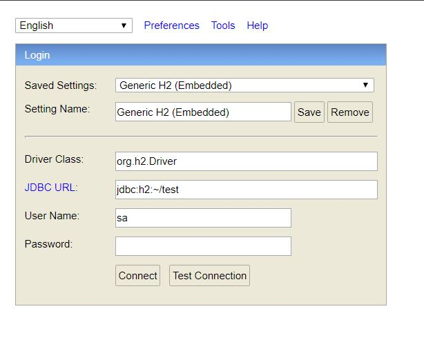
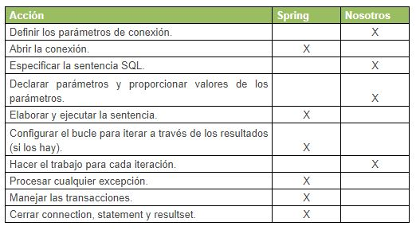
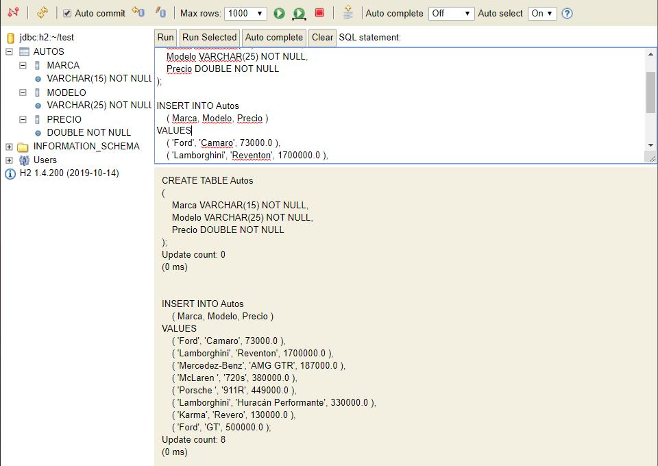
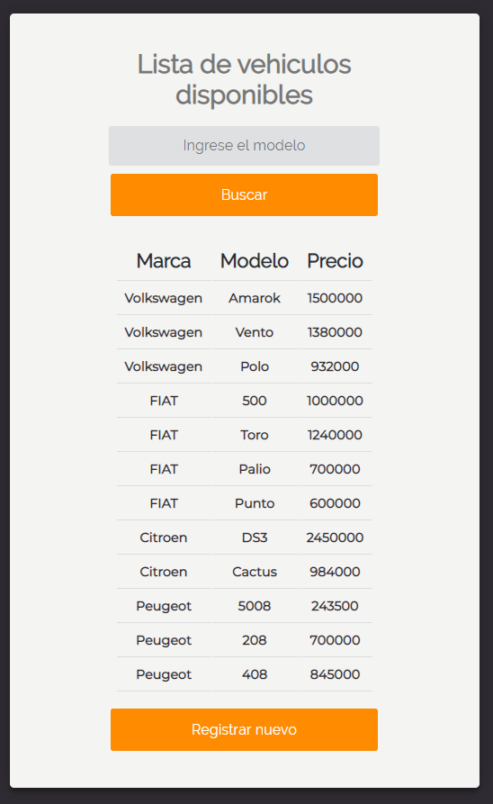
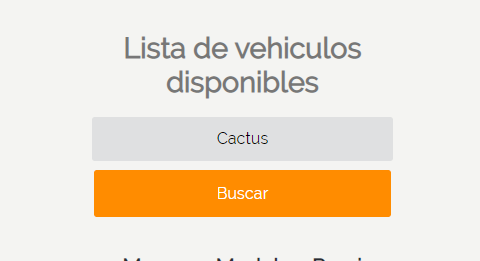
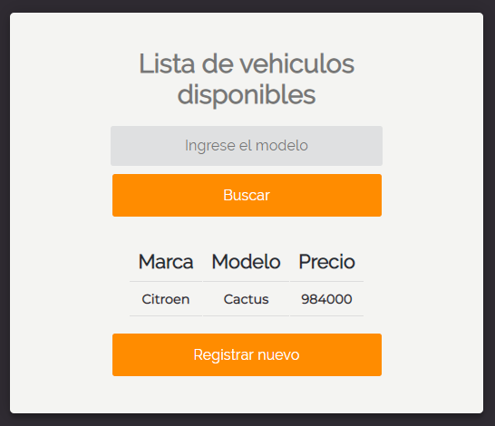
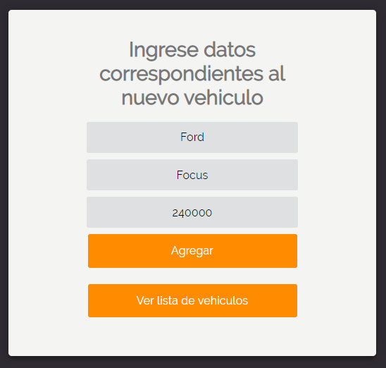
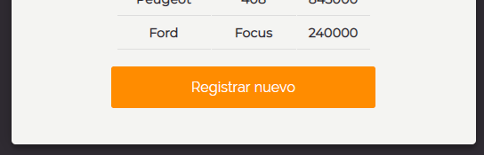

# Concesionaria

Este es un proyecto realizado con [Spring Framework](https://spring.io/), plantea la idea de una lista de vehículos disponible, lograr filtrar por modelo y poder agregar un nuevo vehículo a la tabla.

Este proyecto utilizar 2 nuevas dependencias

**H2** es un sistema administrador de bases de datos relacionales!

**Spring JDBC** abstraccion de JDBC por parte de Spring

## 

## Bases

Con la implementacion de las nuevas dependencias, crearemos una tabla de Autos con la siguiente estructura.

En H2, **jdbc:h2:~/test** sera nuestra base de datos, podremos acceder al gestor de base de datos ingresando en `localhost:8080/h2-console` y podremos observar la imagen que se mostro hace un momento, en ella podremos ingresar las consultas sql para crear e insertar datos a nuestra tabla **'Autos'**

se debe hacer uso de una query y esta se almacenada en un **ResultSet** (Conjunto de resultados que se devuelven de una query) y con **RowMapper**, que se encarga de convertir un **ResultSet** en una lista de objetos . y luego trabajaremos en esa lista para hacer consultas en la tabla.

# Inicio

Luego de iniciar y ingresar en `localhost:8080` podremos observar el siguiente menú.

En la parte superior encontraremos un campo a completa, este debe completarse con el **Modelo** que se desea filtrar la tabla, luego podremos ver que se encuentra de la tabla de lo *Vehiculo*(s) almacenados en la clase *RegistroVehiculos*, dicha clase hace de base de datos. Y por ultimo, en la parte inferior, 

Aplicaremos el filtro el el campo con <u>Cactus</u>, en el caso de entrar el vehículo con dicho modelo, se mostrara en la tabla.

Luego en el apartado de <u>'Registrar nuevo'</u>, se nos dirigirá a otra ventana en la que podremos hacer un alta de un nuevo vehículo.

Y luego que haber completado el campo, podremos agregar el vehículo a la tabla haciendo clic en <u>'Agregar'</u>. Luego podremos regresar atrás en <u>'Ver lista de vehículos'</u> 

Por ultimo podremos ver que se agrego correctamente el nuevo vehículo a la tabla.

### Documentación

Estas son algunas de las referencias que he utilizado, además de [stackoverflow](https://stackoverflow.com/ ) y [YouTube](https://www.youtube.com/)

- https://www.thymeleaf.org/doc/tutorials/3.0/usingthymeleaf.pdf
- http://www.jtech.ua.es/j2ee/publico/spring-2012-13/wholesite.pdf
- http://bibing.us.es/proyectos/abreproy/91289/fichero/MemoriaTFG_rocmenher.pdf
- https://www.baeldung.com/spring-mvc
- https://www.arquitecturajava.com/categoria/spring/spring-mvc/
- https://medium.com/@matedeilo/tips-para-usar-spring-jdbctemplate-486d250dc5a